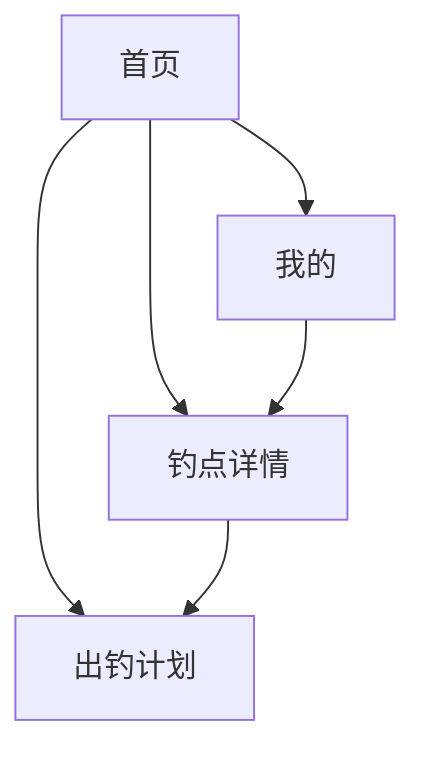
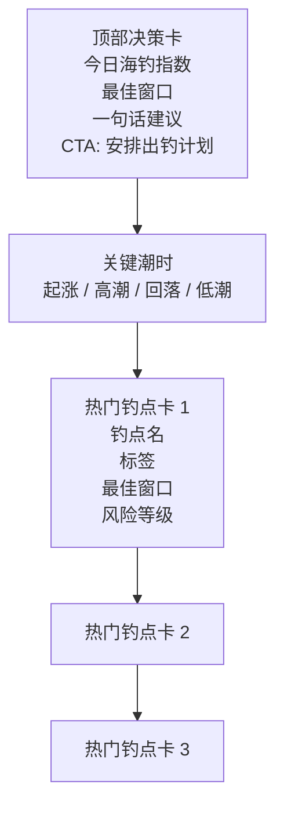
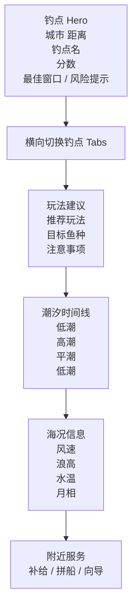

# 海钓潮汐小程序交互设计

## 1. 交互设计目标

这款产品的交互设计围绕三个核心问题展开：

- 今天值不值得去？
- 去哪个钓点更合适？
- 最佳窗口在几点？

因此，交互设计不追求“展示更多数据”，而追求“让用户更快做决定”。

设计原则：

- 决策优先：先给结论，再给数据。
- 钓点优先：以具体钓点为单位组织信息。
- 风险优先：涉及风浪和礁区时，优先提醒安全风险。
- 轻量转化：商业化入口嵌入在自然决策节点，不打断主流程。

## 2. 核心用户路径

### 路径 A：快速看今天能不能去

1. 用户进入首页。
2. 首页首屏直接展示今日海钓指数、最佳窗口和一句话建议。
3. 用户下滑查看热门钓点。
4. 用户点击某个钓点进入详情。
5. 在详情页确认潮汐时间线、玩法建议和风险提示。
6. 用户决定出钓，或进入计划页比较未来两天时段。

### 路径 B：固定钓友查看熟悉钓点

1. 用户进入首页。
2. 直接从热门钓点或收藏入口进入固定钓点。
3. 查看该钓点当日最佳窗口和玩法建议。
4. 浏览附近补给、拼船或向导服务。
5. 完成出钓决策。

### 路径 C：新手用户获取明确建议

1. 用户进入首页。
2. 首屏看到“建议清晨轻矶钓”之类的明确话术。
3. 进入钓点页后，重点看推荐玩法、目标鱼种和注意事项。
4. 通过计划页的出钓清单降低准备门槛。

## 3. 信息架构

```text
底部 Tab
├─ 首页
│  ├─ 今日海钓指数
│  ├─ 最佳窗口
│  ├─ 关键潮时
│  └─ 热门钓点列表
├─ 钓点
│  ├─ 当前钓点概览
│  ├─ 切换钓点
│  ├─ 玩法建议
│  ├─ 潮汐时间线
│  ├─ 海况信息
│  └─ 附近服务
├─ 计划
│  ├─ 未来 48 小时窗口
│  ├─ 钓点对比
│  └─ 出钓清单
└─ 我的
   ├─ 收藏钓点
   ├─ 会员权益
   └─ 商业合作入口
```

## 4. 页面交互说明

## 4.1 首页

### 目标

- 让用户 10 秒内完成第一轮判断。

### 页面结构

1. 顶部决策卡
2. 关键潮时卡片
3. 热门钓点列表

### 关键交互

- 首页首屏只放一个主要 CTA：“安排出钓计划”。
- 海钓指数用大分值和一句话建议组合表达，降低理解门槛。
- 潮汐信息不直接给复杂表格，而是转成“关键潮时”时间卡片。
- 钓点卡片整张可点击，点击后进入详情页。
- 钓点卡上显示标签、最佳窗口和风险等级，帮助用户快速扫读。

### 交互反馈

- 点击钓点卡时，整卡高亮或轻微缩放反馈。
- 风险较高的钓点使用更明确的警示色提示。
- 推荐钓点优先出现在列表前部。

## 4.2 钓点详情页

### 目标

- 让用户对单一钓点做最终判断。

### 页面结构

1. 钓点概览 Hero
2. 横向切换钓点
3. 玩法建议
4. 潮汐时间线
5. 海况信息
6. 附近服务

### 关键交互

- 顶部 Hero 先给结论：分数、最佳窗口、风险提示。
- 横向滑动的钓点切换条，方便用户在相邻钓点间快速切换。
- “玩法建议”模块使用自然语言，而不是专业缩写堆砌。
- “潮汐时间线”采用纵向时间流，便于移动端快速阅读。
- 服务卡片放在详情底部，保证商业信息不打断主决策流程。

### 交互反馈

- 当前钓点 Tab 高亮，切换时刷新详情内容。
- 风险提示用醒目文案展示，例如“不建议站礁”。
- 附近服务按钮采用次级按钮样式，避免喧宾夺主。

## 4.3 出钓计划页

### 目标

- 帮助用户从“今天看一眼”升级到“安排未来两天/本周”。

### 页面结构

1. 未来窗口卡
2. 钓点对比卡
3. 出钓清单

### 关键交互

- 用“周四/周五/周六 + 时间窗口 + 分数”的形式展示未来机会。
- 钓点对比一屏内呈现分数、最佳窗口、风险等级。
- 出钓清单以可扫读文本展示，适合出门前快速检查。

### 交互反馈

- 高分时段视觉更突出。
- 风险较高的钓点对比项使用警示文案而不是纯颜色。

## 4.4 我的页

### 目标

- 承接留存与商业化。

### 页面结构

1. 会员 Hero 卡
2. 我的收藏
3. 会员权益
4. 商业合作入口

### 关键交互

- 收藏钓点放在前面，强化复访路径。
- 会员权益使用简洁条目，不做复杂价格说明。
- 商业合作入口采用卡片式展示，适合后续接商家入驻和 BD 线索。

## 5. 页面跳转关系



## 6. 首页低保真交互线框



## 7. 钓点详情页低保真交互线框



## 8. 关键状态设计

### 8.1 评分状态

- `85-100`：非常值得去，主色高亮。
- `70-84`：适合安排出钓，正常推荐色。
- `55-69`：可观察短时窗口，弱提醒。
- `<55`：建议观望，明确降低推荐权重。

### 8.2 风险状态

- `低风险`：正常展示。
- `中风险`：黄色提醒，文案提示注意风浪。
- `高风险`：橙红提示，明确写“不建议站礁”或“建议撤离”。

### 8.3 空状态

未来接入真实数据时需补以下空态：

- 定位失败：提示用户切换城市或手动选择沿海区域。
- 无钓点数据：提示切换附近城市或订阅城市包。
- 天气接口异常：保留潮汐信息，并提示海况暂不可用。

## 9. 商业化嵌入原则

- 不在首页首屏插入广告。
- 商业信息优先出现在钓点详情底部和我的页。
- 服务卡必须与场景强相关，例如补给、拼船、向导、停车。
- 会员权益强调“提前判断和风险提醒”，而不是简单“去广告”。

## 10. 后续交互升级建议

- 加入“收藏钓点”按钮和动效反馈。
- 增加地图模式，展示附近钓点分布。
- 增加分享海报，方便钓友转发约伴。
- 增加订阅提醒，在优质窗口前推送消息。
- 增加渔获记录入口，让用户形成个人复盘闭环。
